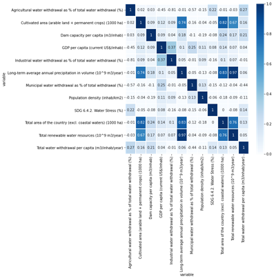

## 1. Introduction
### 1.1 Background
Water is a kind of crucial and finite resources. Only one percent of the water in the world is readily accessible for human use. With the increase of population and the development of society and economics, many countries are faced with water scarcity. In recent years, climate change and land use changes have affected hydrological processes, bringing high uncertainty to precipitation and river flow. Consequently, the water supply systems are under huge pressure. In this case, improving the accuracy of water consumption prediction is of vital importance, which is not only necessary to design new water facilities, but also essential to optimize the operation and management of the existing water supply systems. 

Water consumption is affected many factors, such as water availability, climate, demographics, economics, etc. Machine learning methods have the ability to capture the correlations between independent variables and the non-linear relationships between features and the target variables, so ML methods have been widely applied to complex water consumption modeling and water demand prediction. Villarin and Rodriguez-Galiano (2019) applied two tree-based machine learning methods, including classification and regression trees (CART) and random forest (RF), to the water demand modeling in the city of Seville, Spain at the census tract level. They choose 16 variables that represent the sociodemographic and urban building characteristics of urban area as the independent variables to predict water consumption per capita. The results show that RF model performs better than CART model. 

### 1.2 Objective
The goal of the project is to use machine learning algorithms to predict water withdrawal per capital in the world. Compared with previous, our project will use worldwide data at national scale rather than the data from one city or one country, and we will involve more independent variables such as precipitation, renewable water resources, GDP per capital in order to improve the prediction results. Meanwhile, we plan to use two machine learning algorithms: Neural networks and Random Forest to predict the target variable respectively and compare the model performances. We hope to find a ML method that produces more accurate predictions of water withdrawal, which allows improvement of water resources planning and management.

## 2. Data
### 2.1 Raw Data
The raw dataset was obtained from FAO's Global Information System on Water and Agriculture (AQUASTAT). AQUASTAT provides free access to over 180 variables and indicators by country from 1960s, which are mainly related to water resources, water uses and agricultural water management. 
In this project, we intend to predict annual total water withdrawal per capita and select 13 variables as features based on previous studies, which provide information about geography, economic, climate, water resources utilities, etc. So, the raw dataset used includes 1 dependent variable and 13 features that span 200 countries across 8 different five-year periods from 1978 to 2017.

### 2.2 Exploratory Data Analysis
This project aims at predicting water withdrawal per capita. Water withdrawal per capita is affected many factors, such as water availability, climate, demographics, economics, etc. Let's first look at the water withdrawal per capita.

{#fig: histogram width="4in"}{.center}

As shown in Figure 1, the distribution of total water withdrawal is not symmetric. For 75% entries, the annual total water withdrawal per capita is less than 704.7 m3/inhab/year, while the maximum annual total water withdrawal per capita is 5739 m3/inhab/year. The difference between countries is huge. Let us closely look at the average annual total water withdrawal per capita during 2013-2017 in each country.

{#fig: world width="7in"}{.center}

Although the water withdrawal data during 2013-2017 of many African and west Asian countries are missing, we can find that the water withdrawal per capita varies among countries from Figure 2. For most countries, the total water withdrawal per capita is below 500 m3/inhab/year, but for Canada, the United States, Kazakhstan and Uzbekistan, the value is above 1000 m3/inhab/year.

The raw dataset includes 13 numerical independent variables. However, there are many missing values in the original dataset. It is found that "Human Development Index (HDI)" and "Total population with access to safe drinking-water" are two variables with most missing values. Meanwhile, the correlation coefficients between the target variables and these two independent variables are small. So, these two variables are dropped. After further data cleaning, finally we have a dataset with 410 samples and 11 numerical features and 2 categorical features for predicting water withdrawal per capita.

Figure 3 shows how the 11 independent variables correlate with the target variable and each other. As can be seen, "Long-term average annual precipitation in volume (10^9 m3/year)" and "Total renewable water resources (10^9 m3/year)" are highly related with the correlation coefficient of 0.97. We need to remove one of them for ML model input.

{#fig: corr_matrix width="6.5in"}{.center}

## 3. Methods
### 3.1 Neural Network
Predicting water withdrawal per capita is a complex problem considering various affecting factors and non-linear relationships. We choose neural network to train our model in this project. Artificial Neural Networks have the ability to learn and model non-linear relationships, which is really important for water withdrawal prediction problem.

- Step 1: Data Preprocessing
As there is no missing value in training and testing datasets, we only need to perform feature scaling for numerical variables based on the training dataset. In this step, we normalize the numerical input variables with skew higher than 3 and then standardize all the numerical variables. Considering the distribution of the target variable is skewed, we also normalize the target variable using log transformation.
Since there are two categorical variables (i.e. country and year), we also do some feature engineering to prepare all the variables for use in the model.

- Step 2: Modeling
We design a DNN model with one feature layer, three hidden layers, one linear single-output layer and one layer that inverses the standardization transformation. And for each hidden layer, there is 64 units. To reduce overfitting, dropout is implemented per-layer in the neural network. We choose rectified linear unit activation function (ReLU) as the activation function of hidden layers, which is not only easier to compute but also works better than a smooth function such as the sigmoid. Besides, we choose Mean Squared Error (MSE) as the loss function of our model.

- Step 3: Hyperparameter Tuning
We will use Grid Search that can test the performance of different combinations of hyperparameter values and find the optimal one. The hyperparameters that will be tuned include learning rate, batch size, epochs and dropout rate. In this step, we ignore two categorical variables and only use ten numerical variables as chosen features. 

- Step 4: Predicting 
After obtaining the best combination of hyperparameter values, we train the neural network using training set (287 examples * 80%) and check the performance of model using validation set (287 examples * 20%). Then we use it to predict the annual water withdrawal per capita in the testing set (123 examples).

### 3.2 Random Forests


## 4. Results
### 4.1 Results of Neural Network
We use tensorflow to build Neural Network in this project. The default values of hyperparameters are as follows: learning rate = 0.01, batch size = 40, epoch = 50, and dropout rate = 0.1. The performance of this model is shown in Figure 4 to Figure 6. The RMSE of the training data is 174.35 and the RMSE of the testing data is 259.79.

{#fig: before width="4in"}{.center}

{#fig: before_training width="4in"}{.center}

{#fig: before_validation width="4in"}{.center}

We use Grid Search to tune the hyperparameters to improve the model performance. The results are shown in Table 1.

| Hyperparameters | Possible values     | Best value       |
|:-----------------|:-------------:|:-------------:|
| Batch Size | 2, 4, 8, 16,32, 64 | 64 | 
| Epochs | 10, 50, 100, 200  |100 |
| Learning rate | 0.001, 0.005, 0.01, 0.05, 0.1, 0.2| 0.005 |

Table: The results of hyperparameter tuning
{#tbl:tuning}

In addition, we test several dropout rates to find the value that can reduce overfitting. The results are shown in Table 2 and figures below.

| Dropout rate |  RMSE of Traning data     | RMSE of Validation data  |
|:-----------------|:-------------:|:-------------:|
| 0.1 | 77.03 | 167.24 | 
| 0.2 | 87.31 | 219.42 |
| 0.3 | 312.99| 242.12 |

Table: Model performance under different dropout rate
{#tbl:dropout}

{#fig: dropout_0.1 width="4in"}{.center}

{#fig: dropout_0.2 width="4in"}{.center}

{#fig: dropout_0.3 width="4in"}{.center}

As dropout rate increases, overfitting problem can be reduced, but the RMSE of both training data and validation do not decrease. Therefore, we still set dropout rate at 0.01, which gives the best performance of the model.
So, we find the best combination of hyperparameter values as follows:

- batch size = 64
- epoch = 100
- learning rate = 0.005
- dropout rate = 0.1

{#fig: after_training width="4in"}{.center}

{#fig: after_validation width="4in"}{.center}

Finally, we use this neural network to predict the total annual water withdrawal per capita in the testing dataset, and the Root Mean Squared Error is 144.82.


## Basic formatting

**Bold** __text__

[Semi-bold text]{.semibold}

[Centered text]{.center}

[Right-aligned text]{.right}

*Italic* _text_

Combined *italics and __bold__*

~~Strikethrough~~

1. Ordered list item
2. Ordered list item
    a. Sub-item
    b. Sub-item
        i. Sub-sub-item
3. Ordered list item
    a. Sub-item

- List item
- List item
- List item

subscript: H~2~O is a liquid

superscript: 2^10^ is 1024.

[unicode superscripts](https://www.google.com/search?q=superscript+generator)⁰¹²³⁴⁵⁶⁷⁸⁹

[unicode subscripts](https://www.google.com/search?q=superscript+generator)₀₁₂₃₄₅₆₇₈₉

A long paragraph of text.
Lorem ipsum dolor sit amet, consectetur adipiscing elit, sed do eiusmod tempor incididunt ut labore et dolore magna aliqua.
Ut enim ad minim veniam, quis nostrud exercitation ullamco laboris nisi ut aliquip ex ea commodo consequat.
Duis aute irure dolor in reprehenderit in voluptate velit esse cillum dolore eu fugiat nulla pariatur.
Excepteur sint occaecat cupidatat non proident, sunt in culpa qui officia deserunt mollit anim id est laborum.

Putting each sentence on its own line has numerous benefits with regard to [editing](https://asciidoctor.org/docs/asciidoc-recommended-practices/#one-sentence-per-line) and [version control](https://rhodesmill.org/brandon/2012/one-sentence-per-line/).

Line break without starting a new paragraph by putting  
two spaces at end of line.

## Document organization

Document section headings:

# Heading 1

## Heading 2

### Heading 3

#### Heading 4

##### Heading 5

###### Heading 6

### A heading centered on its own printed page{.center .page_center}

<!-- an arbitrary comment. visible in input, but not visible in output. -->

Horizontal rule:

---

`Heading 1`'s are recommended to be reserved for the title of the manuscript.

`Heading 2`'s are recommended for broad sections such as *Abstract*, *Methods*, *Conclusion*, etc.

`Heading 3`'s and `Heading 4`'s are recommended for sub-sections.

## Links

Bare URL link: <https://manubot.org>

[Long link with lots of words and stuff and junk and bleep and blah and stuff and other stuff and more stuff yeah](https://manubot.org)

[Link with text](https://manubot.org)

[Link with hover text](https://manubot.org "Manubot Homepage")

[Link by reference][manubot homepage]

[Manubot Homepage]: https://manubot.org

## Citations

Citation by DOI [@doi:10.7554/eLife.32822].

Citation by PubMed Central ID [@pmc:PMC6103790].

Citation by PubMed ID [@pubmed:30718888].

Citation by Wikidata ID [@wikidata:Q56458321].

Citation by ISBN [@isbn:9780262517638].

Citation by URL [@https://greenelab.github.io/meta-review/].

Citation by alias [@deep-review].

Multiple citations can be put inside the same set of brackets [@doi:10.7554/eLife.32822; @deep-review; @isbn:9780262517638].
Manubot plugins provide easier, more convenient visualization of and navigation between citations [@doi:10.1371/journal.pcbi.1007128; @pubmed:30718888; @pmc:PMC6103790; @deep-review].

Citation tags (i.e. aliases) can be defined in their own paragraphs using Markdown's reference link syntax:

[@deep-review]: doi:10.1098/rsif.2017.0387

## Referencing figures, tables, equations

Figure @fig:square-image

Figure @fig:wide-image

Figure @fig:tall-image

Figure @fig:vector-image

Table @tbl:bowling-scores

Equation @eq:regular-equation

Equation @eq:long-equation

## Quotes and code

> Quoted text

> Quoted block of text
>
> Two roads diverged in a wood, and I—  
> I took the one less traveled by,  
> And that has made all the difference.

Code `in the middle` of normal text, aka `inline code`.

Code block with Python syntax highlighting:

```python
from manubot.cite.doi import expand_short_doi

def test_expand_short_doi():
    doi = expand_short_doi("10/c3bp")
    # a string too long to fit within page:
    assert doi == "10.25313/2524-2695-2018-3-vliyanie-enhansera-copia-i-insulyatora-gypsy-na-sintez-ernk-modifikatsii-hromatina-i-svyazyvanie-insulyatornyh-belkov-vtransfetsirovannyh-geneticheskih-konstruktsiyah"
```

Code block with no syntax highlighting:

```
Exporting HTML manuscript
Exporting DOCX manuscript
Exporting PDF manuscript
```

## Figures

{#fig:square-image}

{#fig:wide-image}

{#fig:tall-image height=3in}

{#fig:vector-image height=2.5in .white}

## Tables

| *Bowling Scores* | Jane          | John          | Alice         | Bob           |
|:-----------------|:-------------:|:-------------:|:-------------:|:-------------:|
| Game 1 | 150 | 187 | 210 | 105 |
| Game 2 |  98 | 202 | 197 | 102 |
| Game 3 | 123 | 180 | 238 | 134 |

Table: A table with a top caption and specified relative column widths.
{#tbl:bowling-scores}

|         | Digits 1-33                        | Digits 34-66                      | Digits 67-99                      | Ref.                                                        |
|:--------|:-----------------------------------|:----------------------------------|:----------------------------------|:------------------------------------------------------------|
| pi      | 3.14159265358979323846264338327950 | 288419716939937510582097494459230 | 781640628620899862803482534211706 | [`piday.org`](https://www.piday.org/million/)               |
| e       | 2.71828182845904523536028747135266 | 249775724709369995957496696762772 | 407663035354759457138217852516642 | [`nasa.gov`](https://apod.nasa.gov/htmltest/gifcity/e.2mil) |

Table: A table too wide to fit within page.
{#tbl:constant-digits}

|          | **Colors** <!-- $colspan="2" --> |                      |
|:--------:|:--------------------------------:|:--------------------:|
| **Size** | **Text Color**                   | **Background Color** |
| big      | blue                             | orange               |
| small    | black                            | white                |

Table: A table with merged cells using the `attributes` plugin.
{#tbl: merged-cells}

## Equations

A LaTeX equation:

$$\int_0^\infty e^{-x^2} dx=\frac{\sqrt{\pi}}{2}$$ {#eq:regular-equation}

An equation too long to fit within page:

$$x = a + b + c + d + e + f + g + h + i + j + k + l + m + n + o + p + q + r + s + t + u + v + w + x + y + z + 1 + 2 + 3 + 4 + 5 + 6 + 7 + 8 + 9$$ {#eq:long-equation}

## Special

<i class="fas fa-exclamation-triangle"></i> [WARNING]{.semibold} _The following features are only supported and intended for `.html` and `.pdf` exports._
_Journals are not likely to support them, and they may not display correctly when converted to other formats such as `.docx`._

[Link styled as a button](https://manubot.org "Manubot Homepage"){.button}

Adding arbitrary HTML attributes to an element using Pandoc's attribute syntax:

::: {#some_id_1 .some_class style="background: #ad1457; color: white; margin-left: 40px;" title="a paragraph of text" data-color="white" disabled="true"}
Manubot Manubot Manubot Manubot Manubot.
Manubot Manubot Manubot Manubot.
Manubot Manubot Manubot.
Manubot Manubot.
Manubot.
:::

Adding arbitrary HTML attributes to an element with the Manubot `attributes` plugin (more flexible than Pandoc's method in terms of which elements you can add attributes to):

Manubot Manubot Manubot Manubot Manubot.
Manubot Manubot Manubot Manubot.
Manubot Manubot Manubot.
Manubot Manubot.
Manubot.
<!-- $id="element_id" class="some_class" $style="color: #ad1457; margin-left: 40px;" $disabled="true" $title="a paragraph of text" $data-color="red" -->

Available background colors for text, images, code, banners, etc:  

`white`{.white}
`lightgrey`{.lightgrey}
`grey`{.grey}
`darkgrey`{.darkgrey}
`black`{.black}
`lightred`{.lightred}
`lightyellow`{.lightyellow}
`lightgreen`{.lightgreen}
`lightblue`{.lightblue}
`lightpurple`{.lightpurple}
`red`{.red}
`orange`{.orange}
`yellow`{.yellow}
`green`{.green}
`blue`{.blue}
`purple`{.purple}

Using the [Font Awesome](https://fontawesome.com/) icon set:

<!-- include the Font Awesome library, per: https://fontawesome.com/start -->
<link rel="stylesheet" href="https://use.fontawesome.com/releases/v5.7.2/css/all.css">

<i class="fas fa-check"></i> <i class="fas fa-question"></i> <i class="fas fa-star"></i> <i class="fas fa-bell"></i> <i class="fas fa-times-circle"></i> <i class="fas fa-ellipsis-h"></i>

[
<i class="fas fa-scroll fa-lg"></i> **Light Grey Banner**<br>
useful for *general information* - [manubot.org](https://manubot.org/)
]{.banner .lightgrey}

[
<i class="fas fa-info-circle fa-lg"></i> **Blue Banner**<br>
useful for *important information* - [manubot.org](https://manubot.org/)
]{.banner .lightblue}

[
<i class="fas fa-ban fa-lg"></i> **Light Red Banner**<br>
useful for *warnings* - [manubot.org](https://manubot.org/)
]{.banner .lightred}
